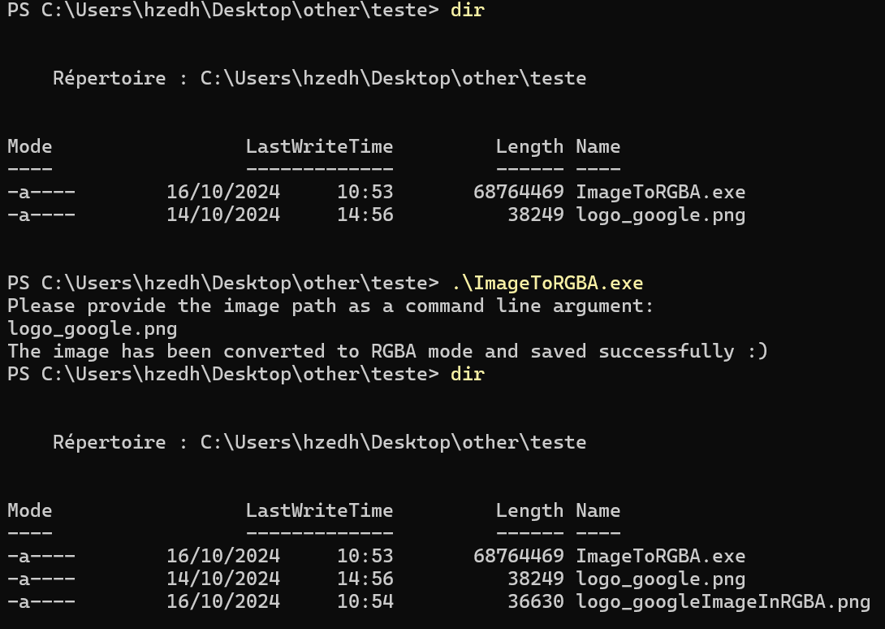

# ImageToRGBA Project in C#

## Description

ImageToRGBA is a C# project that allows you to convert images to PNG format with RGBA (Red, Green, Blue, Alpha) channels..

## Supports

```
jpg
jpeg
bmp
gif
png
ico
Webp
Heif
```

## Features

- Converting images to PNG format with RGBA channels.
- Cross-platform support: Windows, macOS, Linux.

<p align="center">
  
</p>

## Prerequisites

- .NET SDK installed on your machine.

## Download
You can find your OS version in the ReleaseOS folder